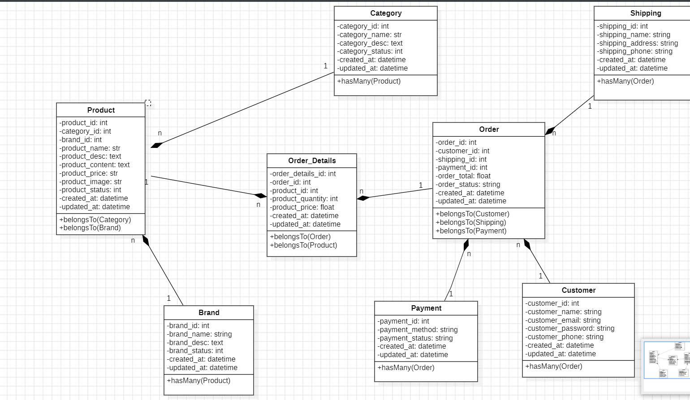

# Hệ thống quản lý Bán Quần Áo

## Giới thiệu

Hệ thống Quản lý Bán Quần Áo được xây dựng trên nền tảng Laravel, nhằm hỗ trợ quản lý sản phẩm quần áo, đơn hàng và doanh thu một cách hiệu quả, giúp tối ưu hóa hoạt động của cửa hàng thời trang.

## Công nghệ sử dụng

-   **Laravel**: Framework PHP mạnh mẽ, linh hoạt, sử dụng cấu trúc MVC rõ ràng để phát triển ứng dụng web nhanh chóng.
-   **MySQL**: Hệ quản trị cơ sở dữ liệu quan hệ phổ biến, dễ sử dụng, hiệu suất cao.
-   **HTML/CSS/JavaScript**: Công nghệ front-end để xây dựng giao diện người dùng thân thiện.
-   **Blade**: Template engine của Laravel, hỗ trợ tạo giao diện động và tái sử dụng.

## Chức năng chính

### Đối với Admin

-   **Quản lý sản phẩm quần áo**: Thêm, sửa, xóa và xem danh sách sản phẩm.
-   **Quản lý đơn hàng**: Xem, xác nhận, chỉnh sửa, xóa và quản lý trạng thái đơn hàng.

### Đối với User (Khách hàng)

-   **Xem sản phẩm**: Duyệt, tìm kiếm và xem chi tiết các sản phẩm quần áo.
-   **Đặt hàng**: Thêm sản phẩm vào giỏ hàng và tạo đơn hàng mới.
-   **Quản lý đơn hàng cá nhân**: Xem lịch sử, trạng thái các đơn hàng đã đặt.
-   **Cập nhật thông tin cá nhân**: Chỉnh sửa thông tin tài khoản, mật khẩu.

## UML

## Link

-   **Link repo**https://github.com/trongduongtkhd/webbandogiadung)

## Hướng dẫn cài đặt

Sau khi tải file về, thực hiện các bước sau:

1. Cài đặt thư viện: `composer install`
2. Đổi tên file `.env.example` thành `.env`
3. Tạo khóa ứng dụng: `php artisan key:generate`
4. Khởi chạy hệ thống: `php artisan serve`
